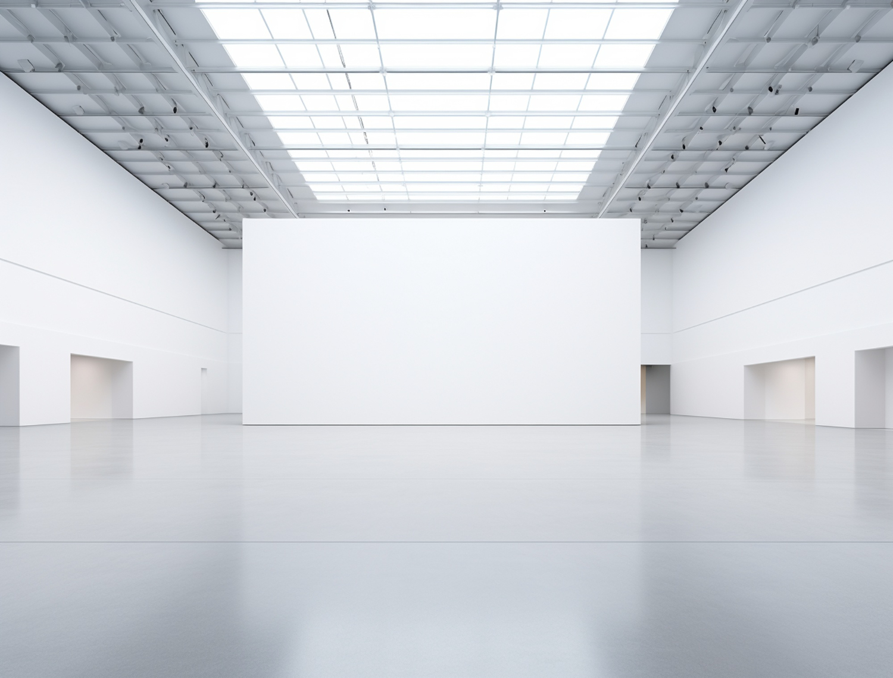
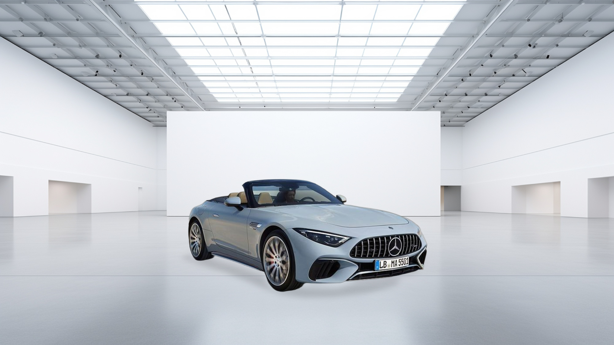

# Car BG Replacement

FastAPI + React. Upload a car photo, pick a scene, get a composited PNG — RMBG-2.0 segmentation, Pillow, OpenCV shadow.

## Pipeline

```
[User Image]
     |
     v
[RMBG-2.0]
     |
     +----> [Car PNG]
     |
[OpenCV Shadow]
     |
     v
[New Background]
     |
     v
[BG + Shadow + Car]
     |
     v
[Final PNG]
```

## Results

| Input | Scene | Output |
|-------|-------|--------|
|  |  |  |

## Run

```bash
cp server/.env.example server/.env   # HF_TOKEN required
cp client/.env.example client/.env   # optional; defaults to localhost:8000
./start.sh
```

- Server → `http://localhost:8000`
- Client → `http://localhost:5173`

---

Made with ❤️ by **Adnan Mushtaq**
